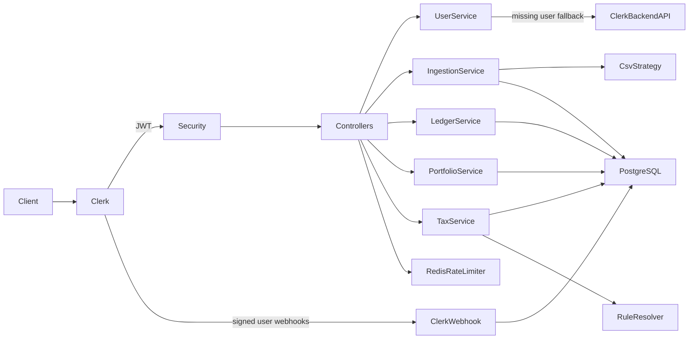

# VDA Ledger

VDA Ledger is a resume-ready Spring Boot backend for importing Binance and CoinDCX INR spot trades, maintaining a secure per-user cryptocurrency ledger, calculating current asset quantities, and estimating Indian Virtual Digital Asset (VDA) tax liability with FIFO cost basis.

This repository is an educational MVP, not a tax-filing platform. Tax output is an estimate and is not financial or legal advice.

## Features

- Clerk JWT authentication through Spring Security OAuth2 Resource Server
- Signed Clerk webhook synchronization for user creation, profile updates, and deletion
- Clerk Backend API fallback for authenticated users whose webhook has not arrived yet
- Secure per-user ownership for ingestion jobs, row errors, ledger events, portfolios, and tax reports
- Synchronous Binance and CoinDCX INR BUY/SELL CSV ingestion
- Strategy-based exchange parsing with Binance and CoinDCX implementations
- Row-level rejection reasons without failing the whole upload
- Deterministic SHA-256 fingerprints and two-layer duplicate detection
- Ingestion history, job details, and persisted duplicate/error rows
- Quantity-only portfolio holdings derived from ledger events
- FIFO cost-basis matching across historical and in-period events
- Versioned FY 2025-2026 and FY 2026-2027 Indian VDA rule sets
- PostgreSQL 16, JSONB, Flyway V1-V6, and Hibernate schema validation
- Redis 7 fixed-window upload rate limiting with an atomic Lua script
- OpenAPI JSON and Swagger UI
- JUnit 5, Mockito, Spring Security Test, and PostgreSQL Testcontainers coverage
- Docker Compose, a multi-stage application Dockerfile, and GitHub Actions CI

## Architecture



The project is a modular monolith under the root package `in.sounodip.vdaledger`. It intentionally avoids microservices, message brokers, background job queues, event sourcing, Kubernetes, and complex observability infrastructure.

## Business flow

```text
Authenticated CSV upload
-> selected exchange parser
-> normalized ledger events
-> error and duplicate handling
-> portfolio calculation
-> FIFO tax estimate
```

## Technology stack

- Java 21
- Spring Boot 3.5.15
- Spring MVC, Validation, Data JPA, Security, OAuth2 Resource Server, Data Redis, and Actuator
- PostgreSQL 16 and Redis 7
- Flyway
- OpenCSV
- Springdoc OpenAPI 2.8.17
- JUnit 5, Mockito, Spring Security Test, and Testcontainers
- Maven, Docker, Docker Compose, and GitHub Actions

Money, quantities, cost basis, and tax rates use `BigDecimal`; persisted timestamps use `Instant`. Indian financial-year boundaries are converted with `ZoneId.of("Asia/Kolkata")`.

## Database migrations

Flyway is the sole schema owner. Hibernate runs with `spring.jpa.hibernate.ddl-auto=validate`.

| Version | Migration | Purpose |
|---|---|---|
| V1 | `V1__create_app_users.sql` | Internal users with a unique Clerk user ID |
| V2 | `V2__create_ingestion_jobs.sql` | Job lifecycle, counters, and user ownership |
| V3 | `V3__create_ledger_events.sql` | BUY/SELL events, numeric precision, and JSONB metadata |
| V4 | `V4__create_ingestion_errors.sql` | Rejected/duplicate rows and JSONB raw data |
| V5 | `V5__create_indexes_and_constraints.sql` | Ownership/history indexes and unique import fingerprints |
| V6 | `V6__sync_clerk_users.sql` | Clerk profile fields, soft-deletion state, and idempotent webhook deliveries |

Important constraints include positive ledger quantities and INR values, non-negative ingestion counters, cascading user/job ownership foreign keys, and a partial unique index on `(user_id, exchange, row_fingerprint)`.

## Local setup

### Prerequisites

- Java 21
- Maven 3.9+
- Docker Desktop or another Docker Engine with Compose
- A Clerk application for real authenticated API calls

### 1. Start PostgreSQL and Redis

```bash
docker compose up -d
docker compose ps
```

PostgreSQL is published on host port `5433` to avoid common local PostgreSQL conflicts. Redis uses `6379`.

### 2. Configure the environment

Copy `.env.example` as a reference, but export the values in your shell or IDE because Spring Boot does not automatically load a root `.env` file.

PowerShell example:

```powershell
$env:DB_URL="jdbc:postgresql://localhost:5433/vda_ledger"
$env:DB_USERNAME="vda_admin"
$env:DB_PASSWORD="vda_password"
$env:REDIS_HOST="localhost"
$env:REDIS_PORT="6379"
$env:CLERK_JWKS_URI="https://your-clerk-domain/.well-known/jwks.json"
$env:CLERK_ISSUER_URI="https://your-clerk-domain"
$env:CLERK_SECRET_KEY="sk_test_your-development-secret-key"
$env:CLERK_WEBHOOK_SIGNING_SECRET="whsec_your-development-webhook-signing-secret"
```

### 3. Run the application

```bash
mvn spring-boot:run -Dspring-boot.run.profiles=dev
```

The development profile defaults the database connection to the Compose PostgreSQL service. Clerk values remain placeholders unless explicitly supplied.

### Environment variables

| Variable | Required | Description |
|---|---:|---|
| `DB_URL` | Yes in the default profile | PostgreSQL JDBC URL |
| `DB_USERNAME` | Yes in the default profile | PostgreSQL username |
| `DB_PASSWORD` | Yes in the default profile | PostgreSQL password |
| `REDIS_HOST` | No | Redis host; defaults to `localhost` |
| `REDIS_PORT` | No | Redis port; defaults to `6379` |
| `CLERK_JWKS_URI` | Yes | Clerk JWKS endpoint used for signature verification |
| `CLERK_ISSUER_URI` | Yes | Expected Clerk JWT issuer |
| `CLERK_SECRET_KEY` | Yes | Server-only Clerk Backend API key used to fetch a user when the local row is missing |
| `CLERK_WEBHOOK_SIGNING_SECRET` | Yes | Signing secret for the configured Clerk webhook endpoint |
| `CLERK_BACKEND_API_URL` | No | Clerk Backend API base URL; defaults to `https://api.clerk.com/v1` |

Never commit real Clerk credentials, tokens, or production database passwords.

`CLERK_WEBHOOK_SECRET_KEY` is accepted as a compatibility alias for
`CLERK_WEBHOOK_SIGNING_SECRET`, but the latter is the canonical name used by this
project. These values are backend-only secrets and must never be exposed through
the frontend or a `NEXT_PUBLIC_*` variable.

## Clerk setup

1. Create or select a Clerk application.
2. Obtain the issuer URL for the Clerk instance.
3. Set `CLERK_ISSUER_URI` to that exact issuer.
4. Set `CLERK_JWKS_URI` to the instance's JWKS endpoint.
5. Copy the development instance Secret Key and set `CLERK_SECRET_KEY`.
6. Acquire a Clerk session token in the client.
7. Send it as `Authorization: Bearer <session-token>`.

The backend verifies the JWT signature, expiration, not-before time when present,
issuer, and subject. It never parses tokens manually and never accepts a public
`userId`. An existing local user is returned without a Clerk API call. If the user
is absent, the verified `sub` is fetched from Clerk with the Secret Key and then
upserted, covering the short interval before a webhook delivery arrives.

### Clerk webhook setup with ngrok

1. Start PostgreSQL and Redis, export the environment variables, and run the
   backend on port `8080`.
2. Start a tunnel:

   ```bash
   ngrok http 8080
   ```

3. In the Clerk Dashboard, create a development webhook endpoint using:

   ```text
   https://<your-ngrok-host>/api/webhooks/clerk
   ```

4. Subscribe it to `user.created`, `user.updated`, and `user.deleted`.
5. Copy that endpoint's Signing Secret into
   `CLERK_WEBHOOK_SIGNING_SECRET`, then restart the backend.
6. Use Clerk's webhook testing UI or create/update/delete a development user.
   A valid request returns HTTP 200 with `processed`; a redelivery returns 200
   with `duplicate`.

The controller reads and verifies the untouched request body with the Svix
signature headers before deserializing JSON. Delivery IDs are persisted so the
same webhook cannot be applied twice. Clerk event timestamps protect the user row
from out-of-order updates. A `user.deleted` event marks the local user as deleted
instead of physically deleting it, preserving that user's ledger and ingestion
history.

The ngrok hostname may change between sessions. If it does, update the endpoint
URL in Clerk. The webhook Signing Secret belongs to the Clerk endpoint and does
not come from ngrok.

## API

### Public

| Method | Path | Purpose |
|---|---|---|
| GET | `/api/health` | Lightweight application health |
| GET | `/actuator/health` | Actuator health |
| GET | `/swagger-ui/index.html` | Swagger UI |
| GET | `/v3/api-docs` | OpenAPI JSON |
| POST | `/api/webhooks/clerk` | Clerk-signed user synchronization webhook |

### Authenticated

| Method | Path | Purpose |
|---|---|---|
| GET | `/api/users/me` | Current internal user |
| POST | `/api/ingestions` | Multipart CSV upload (`exchange`, `file`) |
| GET | `/api/ingestions` | Ingestion history, newest first |
| GET | `/api/ingestions/{jobId}` | Owned job details |
| GET | `/api/ingestions/{jobId}/errors` | Owned row errors |
| GET | `/api/ledger-events` | Owned normalized ledger |
| GET | `/api/portfolio/summary` | Current quantity holdings |
| GET | `/api/taxes/liability?financialYear=2025-2026` | FIFO VDA estimate |

No authenticated business endpoint accepts a public user ID. The webhook endpoint
does not use a bearer token; it authenticates Clerk with its Svix signature and
signing secret instead.

## Supported Binance CSV

Exact logical headers:

```text
Date(UTC),Pair,Side,Price,Executed,Amount,Fee
```

Example:

```csv
Date(UTC),Pair,Side,Price,Executed,Amount,Fee
2025-07-01 10:30:00,BTCINR,BUY,5000000,0.010000 BTC,50000.00 INR,0.000010 BTC
```

Header BOM and surrounding whitespace are tolerated. Pair separators `/`, `-`, and `_` are normalized. Numeric commas are accepted when correctly CSV-quoted. Only positive values, INR quote pairs, and BUY/SELL sides are supported.

Representative row error codes:

- `MISSING_COLUMN_VALUE`
- `INVALID_TRANSACTION_TIMESTAMP`
- `INVALID_NUMERIC_VALUE`
- `UNSUPPORTED_TRADE_SIDE`
- `UNSUPPORTED_QUOTE_ASSET`
- `DUPLICATE_TRANSACTION`

Duplicate detection occurs within the current file, against existing database rows, and finally through a PostgreSQL unique partial index.

Sample files are available in `sample-data/`.

## Supported CoinDCX CSV

CoinDCX INR-settled Spot rows accept the logical fields `Trade ID`, `Crypto
Pair`, `Trade Completion Time`, `Side`, average price, quantity, and gross
amount. Common CoinDCX report-header variants are accepted, including
`Side (Buy/Sell)` and `Average Buying/Selling Price`. Fees and TDS are retained
as ledger metadata but do not change the current tax calculation.

CoinDCX Insta rows may use `Crypto` instead of `Crypto Pair`. Local timestamps
without an explicit offset are interpreted as Asia/Kolkata. Only INR-settled
BUY and SELL operations are supported; USDT and other crypto-to-crypto pairs
are rejected.

## Ingestion lifecycle

- `PENDING -> PROCESSING -> COMPLETED`
- `PENDING -> PROCESSING -> COMPLETED_WITH_ERRORS`
- `PENDING -> PROCESSING -> FAILED`

An individual malformed row is persisted as an error and does not fail the upload. A fatal file-reading or infrastructure failure marks the job `FAILED`.

## Portfolio behavior

The portfolio endpoint reads the authenticated user's ledger in deterministic order, adds BUY quantities, subtracts SELL quantities, rejects impossible negative balances, groups by asset symbol, and removes exact zero positions.

It does not calculate live prices, market value, unrealized gains, or charts.

## Tax behavior

Supported rule sets:

- FY 2025-2026
- FY 2026-2027

For this MVP, both use:

- 30% base VDA tax
- Cost of acquisition as the only deduction
- No loss set-off or carry-forward
- 1% TDS rate as informational metadata
- INR 50,000 specified-person and INR 10,000 other-person TDS thresholds
- 4% Health and Education Cess estimate
- Statutory reference: Income-tax Act, Section 115BBH; Section 194S

FIFO processing loads all events before the selected period end. Older BUY and SELL events establish inventory, while only in-period SELL gains/losses affect the report. Positive gains are summed; losses are reported separately and never offset. Surcharge is `null` because total taxable income and taxpayer category are unavailable. Actual TDS deducted or available as credit is not calculated.

## Redis upload rate limiting

`POST /api/ingestions` is limited to 10 requests per authenticated internal user per 60 seconds by default. The counter and expiry are applied atomically by `redis/fixed_window_rate_limiter.lua`. Rejections return HTTP 429 with `Retry-After`.

The documented MVP policy is fail-open: if Redis is unavailable, the upload proceeds and a warning with the underlying error is logged. This avoids a Redis outage making the entire API unusable.

## Error responses

```json
{
  "timestamp": "2026-07-13T10:00:00Z",
  "status": 400,
  "error": "Bad Request",
  "code": "INVALID_CSV_ROW",
  "message": "Invalid quantity at CSV row 4.",
  "path": "/api/ingestions"
}
```

Unexpected exceptions are logged with stack traces, but stack traces, SQL errors, and internal implementation details are not returned to clients.

## Testing

```bash
mvn clean test
```

The suite includes parser, ingestion, security/controller, portfolio, FIFO lot, tax-rule resolver, tax calculation, Redis fail-open/limit behavior, and a complete PostgreSQL Testcontainers flow. H2 is intentionally not used because the application relies on PostgreSQL JSONB and PostgreSQL-specific constraints.

## Manual acceptance test

Use two Clerk users.

1. Authenticate as User A and call `GET /api/users/me`.
2. Upload `sample-data/binance-inr-valid.csv`; expect 2 imported rows and `COMPLETED`.
3. Upload the same file again; expect 2 duplicate rows and `COMPLETED_WITH_ERRORS`.
4. Retrieve the duplicate errors.
5. Upload `sample-data/binance-inr-mixed.csv`; verify the invalid timestamp is persisted while valid rows import or deduplicate.
6. Retrieve ingestion history, ledger events, portfolio summary, and FY 2025-2026 tax liability.
7. Authenticate as User B; verify history is empty and User A's job/error IDs return 404.
8. Update User B in Clerk and verify the `app_users` profile fields change.
9. Delete User B in Clerk and verify `clerk_deleted` is true while the user's
   financial rows remain present.

For a BUY of 0.01 BTC at INR 50,000 followed by a SELL of 0.005 BTC at INR 35,000, the expected FIFO cost is INR 25,000, positive income is INR 10,000, base tax is INR 3,000, cess is INR 120, and estimated total tax is INR 3,120.

## Docker

Build the optional application image:

```bash
docker build -t vda-ledger .
```

For normal local development, run PostgreSQL/Redis with Compose and run the application from Maven. The Compose file intentionally does not require the application container.

## Known MVP limitations

- Only Binance and CoinDCX INR BUY and SELL spot/Insta trades are supported.
- No USDT-to-INR historical conversion.
- No swaps.
- No staking, mining, rewards, or airdrops.
- No live asset prices or market values.
- No unrealized-gain calculation.
- No actual TDS-credit reconciliation.
- No surcharge calculation.
- No tax-return filing.
- Redis rate limiting fails open during Redis outages.
- Tax output is an estimate and is not financial or legal advice.
