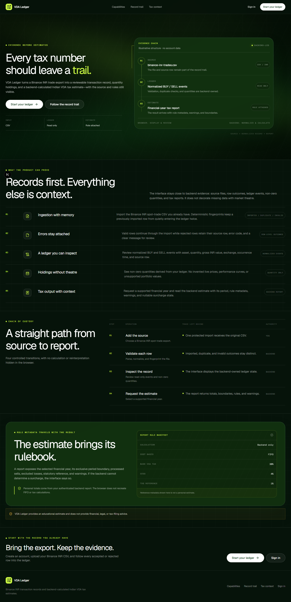
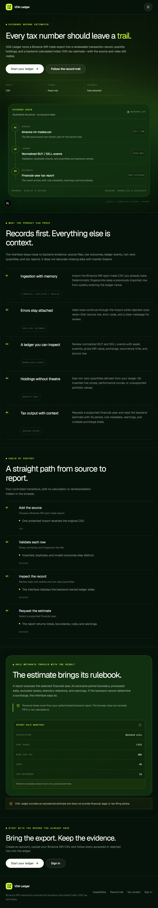
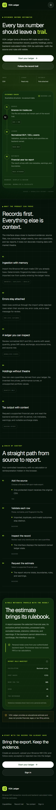

# VDA Ledger Frontend

The Next.js frontend for the existing VDA Ledger Spring Boot API. It imports Binance INR spot-trade CSVs, presents backend-normalized ledger events and quantity-only holdings, and requests backend-calculated Indian VDA tax estimates.

The browser is a presentation and orchestration layer. It does not calculate FIFO, holdings, tax, live prices, valuation, profit/loss, or performance.

## Screenshots

The public experience is captured by Playwright at the required responsive widths.

### Desktop - 1440 x 900



### Tablet - 768 x 1024



### Mobile - 390 x 844



Authenticated screenshots require a valid Clerk session and a running backend, so they are not fabricated.

## Routes

| Route | Purpose |
|---|---|
| `/` | Public product story, workflow, tax-rule context, and disclaimer |
| `/sign-in` | Clerk sign-in |
| `/sign-up` | Clerk sign-up |
| `/app` | Authenticated redirect to the dashboard |
| `/app/dashboard` | Backend-backed overview and recent record trail |
| `/app/upload` | Binance CSV upload |
| `/app/ingestions` | Ingestion history and status filtering |
| `/app/ingestions/[jobId]` | Job lifecycle, counters, and safely escaped row errors |
| `/app/ledger` | Read-only BUY/SELL ledger with presentation-only filters |
| `/app/portfolio` | Non-zero asset quantities |
| `/app/tax` | Backend tax report for a supported financial year |
| `/app/profile` | Clerk-managed email, account settings, and sign-out |

The `/app` layout calls Clerk's server-side `auth.protect()`, covering direct navigation and nested protected routes.

## Architecture and request security

- Next.js 16 App Router, React 19, and strict TypeScript.
- Tailwind CSS semantic tokens implementing the forest, canopy, lime, glass, and gradient-shell design contract.
- Self-hosted Geist package fonts; production builds do not download Google fonts.
- Clerk for browser sessions and server-side route protection.
- TanStack Query for user-scoped remote state, cancellation, invalidation, and isolated loading/error states.
- One typed `fetch` client and feature-local endpoint modules.
- Zod validation for environment configuration, identifiers, upload constraints, and every backend response.
- Lossless JSON number parsing so Java `BigDecimal` values remain exact strings.
- React Hook Form for upload orchestration.
- Lucide linear icons and a reduced-motion-aware WebGL ledger field with a DOM/CSS fallback.

For each protected request:

1. Clerk finishes loading and establishes the signed-in user scope.
2. `getToken()` supplies a fresh session token.
3. The API client strips caller-provided authorization, then sets the fresh `Bearer` credential.
4. The client permits only same-origin API-base requests whose path begins with `/api/`.
5. The Spring backend validates the JWT and derives ownership from the verified subject.
6. The response is parsed without decimal precision loss and validated by Zod.

Tokens are not copied into local storage, session storage, cookies owned by application code, query keys, errors, or logs. Signing out or changing identity clears the query cache. Production error details are normalized before display.

The product UI does not request `/api/users/me`, retain its internal-user response, or render Clerk/internal user identifiers. Clerk still manages its own signed-in identity internally as required for authentication.

## Verified backend contract

| Method | Endpoint | Consumer |
|---|---|---|
| `GET` | `/api/users/me` | Not consumed by the product UI; retained as a backend contract reference |
| `POST` | `/api/ingestions` | Upload; multipart fields are exactly `exchange=BINANCE` and `file` |
| `GET` | `/api/ingestions` | Dashboard and ingestion history |
| `GET` | `/api/ingestions/{jobId}` | Ingestion detail |
| `GET` | `/api/ingestions/{jobId}/errors` | Row-error review |
| `GET` | `/api/ledger-events` | Dashboard and ledger |
| `GET` | `/api/portfolio/summary` | Dashboard and holdings |
| `GET` | `/api/taxes/liability?financialYear=...` | Tax report |

The accepted upload is a `.csv` no larger than 20 MB. The browser checks only file-level constraints; parsing, duplicate detection, normalization, FIFO, holdings, and tax logic remain backend responsibilities. The upload client leaves multipart `Content-Type` unset so the browser supplies the boundary.

Supported financial years are `2025-2026` and `2026-2027`, matching backend rule versions in this workspace.

## Local setup

### Prerequisites

- Node.js 20.9 or newer and npm
- The sibling Spring Boot backend with PostgreSQL and Redis
- One Clerk application shared by the frontend and backend issuer/JWKS configuration

### Frontend

```powershell
cd C:\Users\pc\Desktop\VDA_Ledger\frontend
npm install
Copy-Item .env.example .env.local
npm run dev
```

Replace the placeholders in `.env.local` with development or test Clerk values. Never commit `.env.local`.

### Backend

Follow `../backend/README.md`, set `FRONTEND_ORIGIN=http://localhost:3000`, and start the backend:

```powershell
cd C:\Users\pc\Desktop\VDA_Ledger\backend
mvn spring-boot:run -Dspring-boot.run.profiles=dev
```

The backend already defines CORS in `SecurityConfig`: it uses the exact configured frontend origin, permits the implemented methods, allows `Authorization` and `Content-Type`, exposes `Retry-After`, and rejects wildcard credentialed origins. The frontend API base defaults to `http://localhost:8080`.

`CLERK_ISSUER_URI` and `CLERK_JWKS_URI` must use the same Clerk instance encoded by `NEXT_PUBLIC_CLERK_PUBLISHABLE_KEY`. A placeholder or different issuer causes Spring to reject an otherwise valid session token with `INVALID_BEARER_TOKEN`.

## CSV workflow

1. Export Binance spot-trade history using the backend's expected columns.
2. Sign in and open `/app/upload`.
3. Select a CSV and submit it as `BINANCE`.
4. Review backend-returned imported, failed, and duplicate counts.
5. Inspect row-level codes, messages, and escaped raw data on the job detail page.
6. Review normalized events, non-zero quantities, and a backend-generated tax report.

A failed row never becomes an invented frontend transaction.

## UX behavior

- Route and query skeletons preserve layout while data loads.
- Dashboard queries fail independently so one unavailable endpoint does not hide successful sections.
- Empty screens explain what is absent and link to the next valid action.
- Network, 401, 403, 404, 409, 422, 429, and 5xx responses receive distinct safe treatment.
- Row data is rendered as escaped text inside collapsible, scrollable containers.
- Status uses icons and visible text, never color alone.
- Focus rings, labels, landmarks, 44px controls, a focus-trapped mobile drawer, Escape handling, and focus restoration support keyboard and touch use.
- Motion respects `prefers-reduced-motion`.
- Tables become cards where narrow-screen scanning benefits.

## Verification

```powershell
npm run typecheck
npm run lint
npm run test:run
npx playwright install chromium
npm run test:e2e
npm run test:e2e:auth
npm run build
```

Current result:

- TypeScript: pass
- ESLint: pass with zero warnings
- Vitest/MSW: 33 tests passed across 7 files
- Public Playwright: 9 checks passed and 3 breakpoint-inapplicable checks skipped
- Authenticated Playwright: 2 checks passed against the real Clerk test instance and running Spring API
- Production build: pass
- Browser widths: 390, 768, 1024, and 1440 pixels

The authenticated browser suite uses Clerk's official testing helper and a dedicated development-instance user. It proves that Clerk issues the session, all dashboard calls include bearer authorization, Spring accepts the token for ingestions/ledger/portfolio/tax, dashboard/profile never request `/api/users/me`, neither user identifier is rendered, and sign-out removes protected access. It contains no auth bypass.

## Deployment checklist

1. Set every `.env.example` variable in the deployment environment.
2. Use an HTTPS API origin with no embedded credentials, path, query, or fragment.
3. Set the exact deployed frontend origin in the backend CORS configuration.
4. Register deployment and redirect URLs in Clerk.
5. Configure the backend with the same Clerk issuer and JWKS endpoint.
6. Run the complete verification suite in CI.
7. Against staging, verify sign-up, sign-in, upload, errors, ledger, holdings, tax-year switching, sign-out, and an expired-session request.

## Intentional limits

- Binance only.
- INR quote pairs and BUY/SELL spot trades only.
- Read-only ledger, holdings, and tax output.
- No transaction editing or deletion.
- No live prices, valuation, allocation charts, returns, or performance.
- No frontend tax, FIFO, holdings, or financial calculations.
- No tax filing, legal advice, or automated submission.

The authenticated dashboard path is covered against live local services. A destructive or state-changing acceptance pass—particularly uploading a CSV and verifying the resulting records—still requires an intentionally selected test fixture.

## Working documents

- `docs/frontend-existing-state-audit.md`
- `docs/frontend-design-contract.md`
- `docs/frontend-route-status.md`
- `docs/backend-api-contract.md`
- `docs/frontend-implementation-notes.md`
